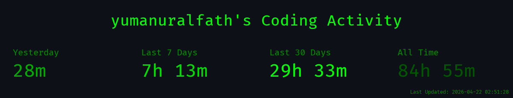
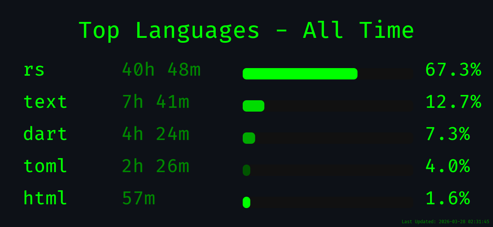
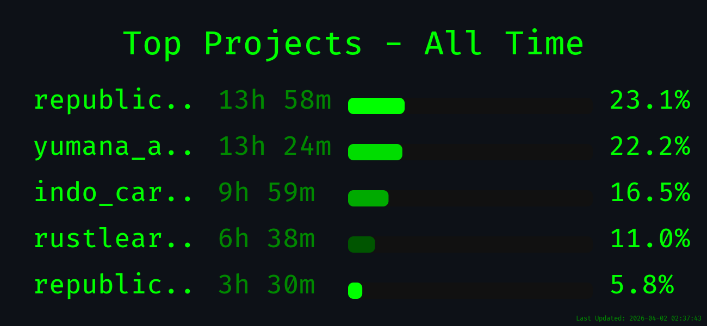
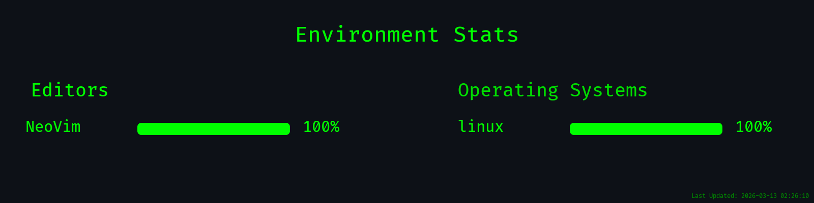

<div align='center'>
<summary><h1 style="color: red;">Welcome to My Profile✨</h1></summary>
</div>
<div align="center">
<!--horizontal divider(gradiant)-->

</div>
  
</div>
<!--h1 without bottom border-->
<div id="user-content-toc">
  <ul align="center">
    <summary><h2 style="display: inline-block">Hi 👋, I'm Yuma </h2></summary>
  </ul>
</div>
<!--takatime-start-->

<h2 align="center">TakaTime Weekly Report</h2>

<p align="center">
  <br/>
  
  <br/>
  
</p>

<p align="center"><em>Generated automatically by <a href="https://github.com/Rtarun3606k/TakaTime">TakaTime</a></em></p>

<!--takatime-end-->
<p align="center">
  
</p>

**Code Time Since May 4, 2024**

- [](https://wakatime.com/@dc384f06-ca40-47b3-af9c-3e0560a1bcfa)
- [](https://leetcode.com/yumanuralfath)
  <!--START_SECTION:waka-->


**I'm an Early 🐤** 

```text
🌞 Morning                717 commits         █████████████░░░░░░░░░░░░   53.59 % 
🌆 Daytime                350 commits         ███████░░░░░░░░░░░░░░░░░░   26.16 % 
🌃 Evening                239 commits         ████░░░░░░░░░░░░░░░░░░░░░   17.86 % 
🌙 Night                  32 commits          █░░░░░░░░░░░░░░░░░░░░░░░░   02.39 % 
```
📅 **I'm Most Productive on Saturday** 

```text
Monday                   167 commits         ███░░░░░░░░░░░░░░░░░░░░░░   12.48 % 
Tuesday                  180 commits         ███░░░░░░░░░░░░░░░░░░░░░░   13.45 % 
Wednesday                227 commits         ████░░░░░░░░░░░░░░░░░░░░░   16.97 % 
Thursday                 128 commits         ██░░░░░░░░░░░░░░░░░░░░░░░   09.57 % 
Friday                   175 commits         ███░░░░░░░░░░░░░░░░░░░░░░   13.08 % 
Saturday                 255 commits         █████░░░░░░░░░░░░░░░░░░░░   19.06 % 
Sunday                   206 commits         ████░░░░░░░░░░░░░░░░░░░░░   15.40 % 
```


📊 **This Week I Spent My Time On** 

```text
💬 Programming Languages: 
Rust                     17 hrs 4 mins       █████████████░░░░░░░░░░░░   50.34 % 
Dart                     5 hrs 57 mins       ████░░░░░░░░░░░░░░░░░░░░░   17.54 % 
TOML                     2 hrs 13 mins       ██░░░░░░░░░░░░░░░░░░░░░░░   06.55 % 
Markdown                 1 hr 46 mins        █░░░░░░░░░░░░░░░░░░░░░░░░   05.25 % 
Bash                     1 hr 12 mins        █░░░░░░░░░░░░░░░░░░░░░░░░   03.57 % 

🐱‍💻 Projects: 
yumana_api_V2            10 hrs 56 mins      ████████░░░░░░░░░░░░░░░░░   32.27 % 
rustlearn                6 hrs 32 mins       █████░░░░░░░░░░░░░░░░░░░░   19.27 % 
republic_card_game       6 hrs 7 mins        █████░░░░░░░░░░░░░░░░░░░░   18.04 % 
republic_card_game-nusant3 hrs 5 mins        ██░░░░░░░░░░░░░░░░░░░░░░░   09.10 % 
Unknown Project          2 hrs 52 mins       ██░░░░░░░░░░░░░░░░░░░░░░░   08.45 % 
```

**I Mostly Code in JavaScript** 

```text
Rust                     17 repos            █████░░░░░░░░░░░░░░░░░░░░   20.00 % 
HTML                     7 repos             ██░░░░░░░░░░░░░░░░░░░░░░░   08.24 % 
Shell                    4 repos             █░░░░░░░░░░░░░░░░░░░░░░░░   04.71 % 
C++                      3 repos             █░░░░░░░░░░░░░░░░░░░░░░░░   03.53 % 
Dockerfile               1 repo              ░░░░░░░░░░░░░░░░░░░░░░░░░   01.18 % 
```


 Last Updated on 01/03/2026 17:25:08 UTC
<!--END_SECTION:waka-->

<!--h1 without bottom border-->
<!-- <div id="user-content-toc"> -->
<!--   <ul align="center"> -->
<!--     <summary><h2 style="display: inline-block">Technologies That I Know👨🏻‍💻</h2></summary> -->
<!--   </ul> -->
<!-- </div> -->
<!--tech stack icons-->
<!-- <p align="center"> -->
<!--   <a href="https://skillicons.dev"> -->
<!--      -->
<!--   </a> -->
<!-- </p> -->

<!-- Connect with me -->
<!--h2 without bottom border-->
<div id="user-content-toc">
  <ul align="center">
    <summary><h2 style="display: inline-block">Connect With Me🤝</h2></summary>
  </ul>
</div>

<!--icons and links-->
<p align="center">
<a href="https://www.linkedin.com/in/yumana/" target="blank"></a>
<a href="https://www.instagram.com/yumana20" target="blank"></a>
<a href="https://discordapp.com/users/393721612358254592" target="blank"></a>
  
</p>

<!--horizontal divider(gradiant)-->


---
