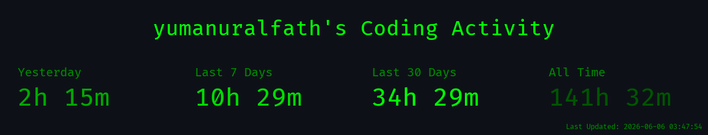
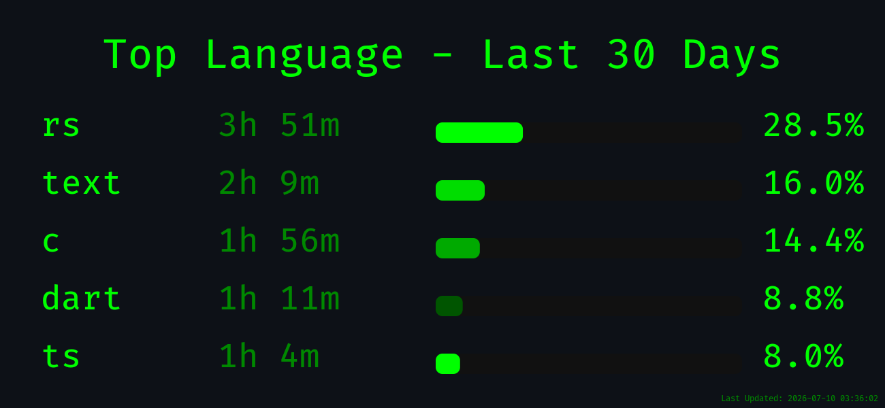
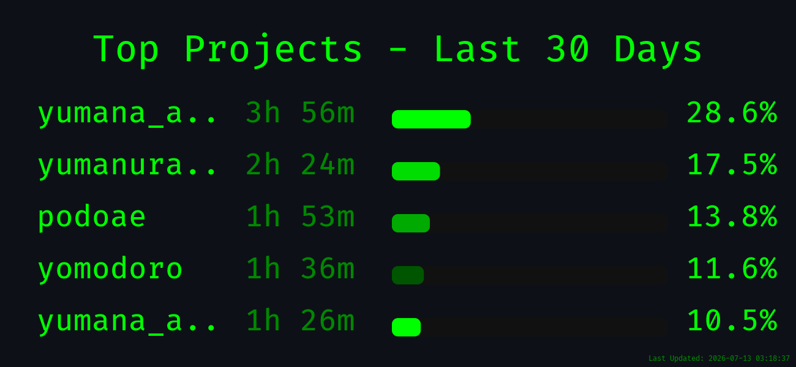
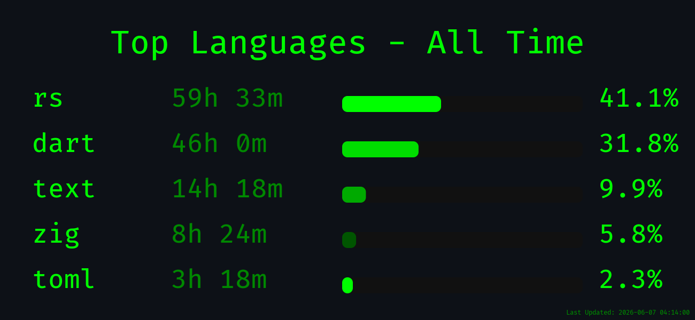
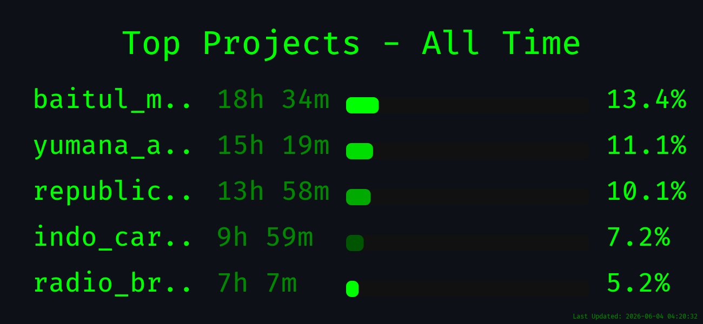
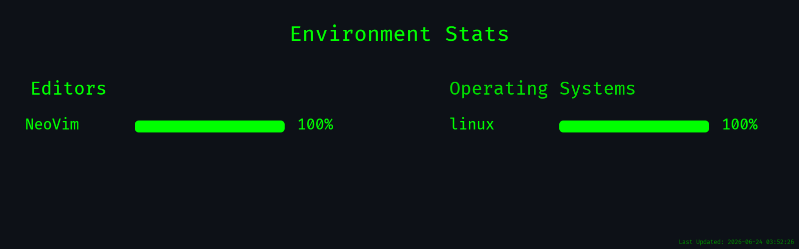

<div align='center'>
<summary><h1 style="color: red;">Welcome to My Profile✨</h1></summary>
</div>
<div align="center">
<!--horizontal divider(gradiant)-->

</div>
  
</div>
<!--h1 without bottom border-->
<div id="user-content-toc">
  <ul align="center">
    <summary><h2 style="display: inline-block">Hi 👋, I'm Yuma </h2></summary>
  </ul>
</div>
<!--takatime-start-->

<h2 align="center">TakaTime Weekly Report</h2>

<p align="center">
  <br/>
  
  <br/>
  
  <br/>
  
</p>

<p align="center"><em>Generated automatically by <a href="https://github.com/Rtarun3606k/TakaTime">TakaTime</a></em></p>

<!--takatime-end-->
<p align="center">
  
</p>

**Code Time Since May 4, 2024**

- [](https://wakatime.com/@dc384f06-ca40-47b3-af9c-3e0560a1bcfa)
- [](https://leetcode.com/yumanuralfath)
  <!--START_SECTION:waka-->


**I'm an Early 🐤** 

```text
🌞 Morning                750 commits         ██████████████░░░░░░░░░░░   54.51 % 
🌆 Daytime                345 commits         ██████░░░░░░░░░░░░░░░░░░░   25.07 % 
🌃 Evening                247 commits         ████░░░░░░░░░░░░░░░░░░░░░   17.95 % 
🌙 Night                  34 commits          █░░░░░░░░░░░░░░░░░░░░░░░░   02.47 % 
```
📅 **I'm Most Productive on Saturday** 

```text
Monday                   175 commits         ███░░░░░░░░░░░░░░░░░░░░░░   12.72 % 
Tuesday                  178 commits         ███░░░░░░░░░░░░░░░░░░░░░░   12.94 % 
Wednesday                231 commits         ████░░░░░░░░░░░░░░░░░░░░░   16.79 % 
Thursday                 138 commits         ███░░░░░░░░░░░░░░░░░░░░░░   10.03 % 
Friday                   183 commits         ███░░░░░░░░░░░░░░░░░░░░░░   13.30 % 
Saturday                 259 commits         █████░░░░░░░░░░░░░░░░░░░░   18.82 % 
Sunday                   212 commits         ████░░░░░░░░░░░░░░░░░░░░░   15.41 % 
```


📊 **This Week I Spent My Time On** 

```text
💬 Programming Languages: 
Dart                     9 hrs 25 mins       █████████████░░░░░░░░░░░░   50.43 % 
Rust                     6 hrs 34 mins       █████████░░░░░░░░░░░░░░░░   35.20 % 
Markdown                 1 hr 56 mins        ███░░░░░░░░░░░░░░░░░░░░░░   10.43 % 
TOML                     15 mins             ░░░░░░░░░░░░░░░░░░░░░░░░░   01.42 % 
Bash                     12 mins             ░░░░░░░░░░░░░░░░░░░░░░░░░   01.12 % 

🐱‍💻 Projects: 
baitul_mal_plus          7 hrs 55 mins       ███████████░░░░░░░░░░░░░░   42.46 % 
kpf_comic_reducer        5 hrs 40 mins       ████████░░░░░░░░░░░░░░░░░   30.35 % 
Obsidian-Note            1 hr 55 mins        ███░░░░░░░░░░░░░░░░░░░░░░   10.32 % 
Unknown Project          1 hr 40 mins        ██░░░░░░░░░░░░░░░░░░░░░░░   08.95 % 
kpf_comic_compress       46 mins             █░░░░░░░░░░░░░░░░░░░░░░░░   04.12 % 
```

**I Mostly Code in JavaScript** 

```text
Rust                     19 repos            █████░░░░░░░░░░░░░░░░░░░░   21.59 % 
HTML                     7 repos             ██░░░░░░░░░░░░░░░░░░░░░░░   07.95 % 
C++                      3 repos             █░░░░░░░░░░░░░░░░░░░░░░░░   03.41 % 
Dart                     1 repo              ░░░░░░░░░░░░░░░░░░░░░░░░░   01.14 % 
Dockerfile               1 repo              ░░░░░░░░░░░░░░░░░░░░░░░░░   01.14 % 
```


 Last Updated on 13/04/2026 18:03:51 UTC
<!--END_SECTION:waka-->

<!--h1 without bottom border-->
<!-- <div id="user-content-toc"> -->
<!--   <ul align="center"> -->
<!--     <summary><h2 style="display: inline-block">Technologies That I Know👨🏻‍💻</h2></summary> -->
<!--   </ul> -->
<!-- </div> -->
<!--tech stack icons-->
<!-- <p align="center"> -->
<!--   <a href="https://skillicons.dev"> -->
<!--      -->
<!--   </a> -->
<!-- </p> -->

<!-- Connect with me -->
<!--h2 without bottom border-->
<div id="user-content-toc">
  <ul align="center">
    <summary><h2 style="display: inline-block">Connect With Me🤝</h2></summary>
  </ul>
</div>

<!--icons and links-->
<p align="center">
<a href="https://www.linkedin.com/in/yumana/" target="blank"></a>
<a href="https://www.instagram.com/yumana20" target="blank"></a>
<a href="https://discordapp.com/users/393721612358254592" target="blank"></a>
  
</p>

<!--horizontal divider(gradiant)-->


---
