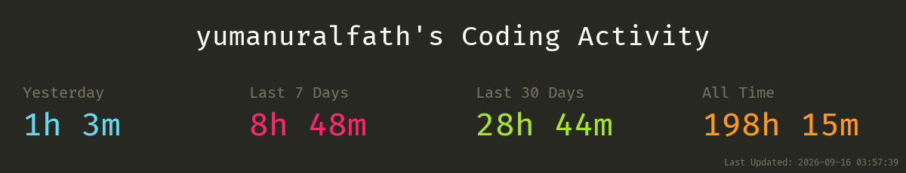
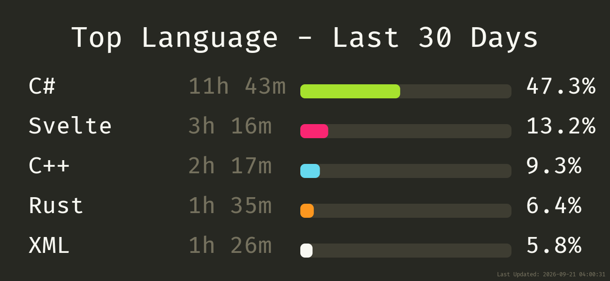
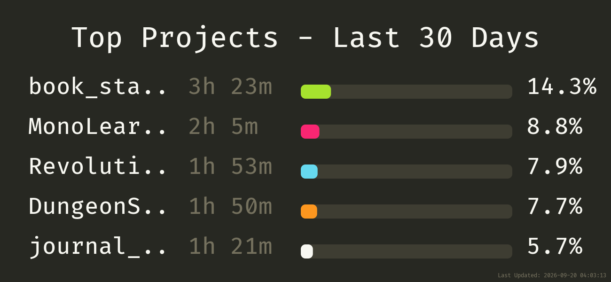
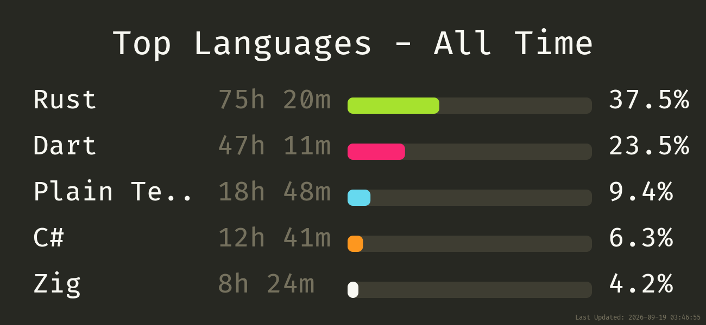
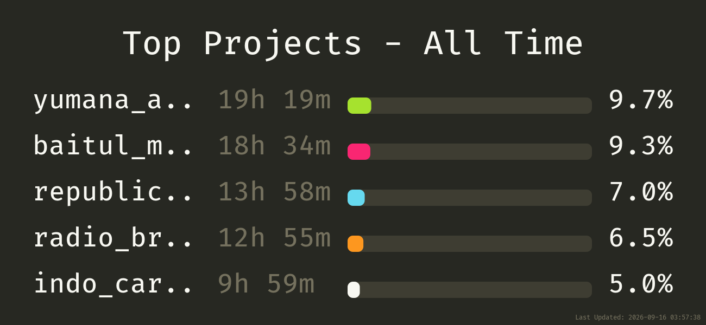
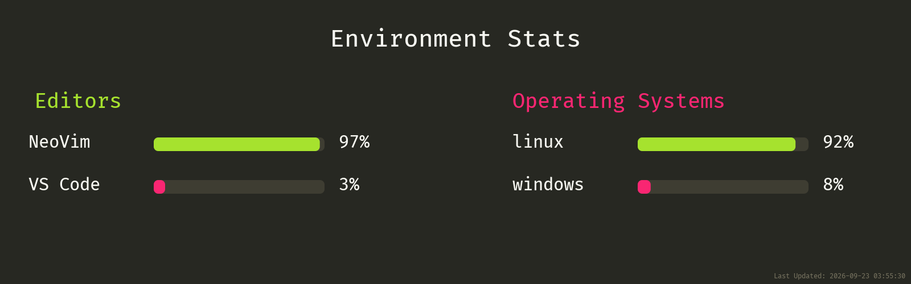

<div align='center'>
<summary><h1 style="color: red;">Welcome to My Profile✨</h1></summary>
</div>
<div align="center">
<!--horizontal divider(gradiant)-->

</div>
  
</div>
<!--h1 without bottom border-->
<div id="user-content-toc">
  <ul align="center">
    <summary><h2 style="display: inline-block">Hi 👋, I'm Yuma </h2></summary>
  </ul>
</div>
<!--takatime-start-->

<h2 align="center">TakaTime Weekly Report</h2>

<p align="center">
  <br/>
  
  <br/>
  
  <br/>
  
</p>

<p align="center"><em>Generated automatically by <a href="https://github.com/Rtarun3606k/TakaTime">TakaTime</a></em></p>

<!--takatime-end-->
<p align="center">
  
</p>

**Code Time Since May 4, 2024**

- [](https://wakatime.com/@dc384f06-ca40-47b3-af9c-3e0560a1bcfa)
- [](https://leetcode.com/yumanuralfath)
  <!--START_SECTION:waka-->


**I'm an Early 🐤** 

```text
🌞 Morning                950 commits         ██████████████░░░░░░░░░░░   54.63 % 
🌆 Daytime                406 commits         ██████░░░░░░░░░░░░░░░░░░░   23.35 % 
🌃 Evening                344 commits         █████░░░░░░░░░░░░░░░░░░░░   19.78 % 
🌙 Night                  39 commits          █░░░░░░░░░░░░░░░░░░░░░░░░   02.24 % 
```
📅 **I'm Most Productive on Saturday** 

```text
Monday                   247 commits         ████░░░░░░░░░░░░░░░░░░░░░   14.20 % 
Tuesday                  251 commits         ████░░░░░░░░░░░░░░░░░░░░░   14.43 % 
Wednesday                294 commits         ████░░░░░░░░░░░░░░░░░░░░░   16.91 % 
Thursday                 174 commits         ███░░░░░░░░░░░░░░░░░░░░░░   10.01 % 
Friday                   232 commits         ███░░░░░░░░░░░░░░░░░░░░░░   13.34 % 
Saturday                 310 commits         ████░░░░░░░░░░░░░░░░░░░░░   17.83 % 
Sunday                   231 commits         ███░░░░░░░░░░░░░░░░░░░░░░   13.28 % 
```


📊 **This Week I Spent My Time On** 

```text
💬 Programming Languages: 
Markdown                 3 hrs 30 mins       ██████████████░░░░░░░░░░░   56.88 % 
Rust                     1 hr 47 mins        ███████░░░░░░░░░░░░░░░░░░   29.04 % 
Other                    17 mins             █░░░░░░░░░░░░░░░░░░░░░░░░   04.71 % 
Lua                      16 mins             █░░░░░░░░░░░░░░░░░░░░░░░░   04.40 % 
Text                     15 mins             █░░░░░░░░░░░░░░░░░░░░░░░░   04.07 % 

🐱‍💻 Projects: 
Obsidian-Note            2 hrs 53 mins       ████████████░░░░░░░░░░░░░   46.82 % 
journal                  1 hr 47 mins        ███████░░░░░░░░░░░░░░░░░░   29.04 % 
AyoMenulis               37 mins             ███░░░░░░░░░░░░░░░░░░░░░░   10.04 % 
Unknown Project          16 mins             █░░░░░░░░░░░░░░░░░░░░░░░░   04.36 % 
dotfiles                 15 mins             █░░░░░░░░░░░░░░░░░░░░░░░░   04.10 % 
```

🤖 **AI Coding This Week** 

```text
⏱ AI Coding Time: 1 hr 7 mins (18.28%)

✍️ 23 lines written by AI, 320 lines written by hand (6.71% AI-written)

🔤 0 Input Tokens, 0 Output Tokens

💵 $0.00 Estimated AI Cost This Week

🧠 6 AI Sessions, 7 AI Prompts

Gemini                   24 lines            █████████████████████████   100.00 % 

🔎 AI Coding Insights:
🧑‍💻 Mostly Hands-On — 6.71% of written lines came from AI
📝 Concise Prompter — average 173 characters per prompt
🎯 One-Shot Prompter — average 1 prompts per session
🔍 Hands-On Reviewer — 94.34% of changed lines were hand-edited
```

**I Mostly Code in Rust** 

```text
Rust                     22 repos            ██████░░░░░░░░░░░░░░░░░░░   22.45 % 
TypeScript               8 repos             ██░░░░░░░░░░░░░░░░░░░░░░░   08.16 % 
C++                      4 repos             █░░░░░░░░░░░░░░░░░░░░░░░░   04.08 % 
Dart                     3 repos             █░░░░░░░░░░░░░░░░░░░░░░░░   03.06 % 
Astro                    1 repo              ░░░░░░░░░░░░░░░░░░░░░░░░░   01.02 % 
```


 Last Updated on 15/08/2026 17:22:31 UTC
<!--END_SECTION:waka-->

<!--h1 without bottom border-->
<!-- <div id="user-content-toc"> -->
<!--   <ul align="center"> -->
<!--     <summary><h2 style="display: inline-block">Technologies That I Know👨🏻‍💻</h2></summary> -->
<!--   </ul> -->
<!-- </div> -->
<!--tech stack icons-->
<!-- <p align="center"> -->
<!--   <a href="https://skillicons.dev"> -->
<!--      -->
<!--   </a> -->
<!-- </p> -->

<!-- Connect with me -->
<!--h2 without bottom border-->
<div id="user-content-toc">
  <ul align="center">
    <summary><h2 style="display: inline-block">Connect With Me🤝</h2></summary>
  </ul>
</div>

<!--icons and links-->
<p align="center">
<a href="https://www.linkedin.com/in/yumana/" target="blank"></a>
<a href="https://www.instagram.com/yumana20" target="blank"></a>
<a href="https://discordapp.com/users/393721612358254592" target="blank"></a>
  
</p>

<!--horizontal divider(gradiant)-->


---
