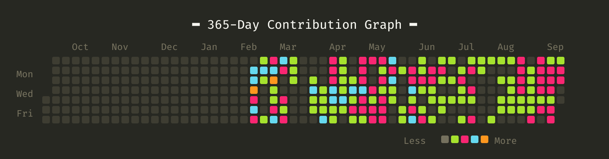

<div align='center'>
<summary><h1 style="color: red;">Welcome to My Profile✨</h1></summary>
</div>
<div align="center">
<!--horizontal divider(gradiant)-->

</div>
  
</div>
<!--h1 without bottom border-->

<!--takatime-start-->

<h2 align="center">TakaTime Weekly Report</h2>

<p align="center">
  <br/>
  
  <br/>
  
  <br/>
  
  
</p>

<p align="center"><em>Generated automatically by <a href="https://github.com/Rtarun3606k/TakaTime">TakaTime</a></em></p>

<!--takatime-end-->
<p align="center">
  
</p>

**Code Time Since May 4, 2024**

- [](https://wakatime.com/@dc384f06-ca40-47b3-af9c-3e0560a1bcfa)
- [](https://leetcode.com/yumanuralfath)
  <!--START_SECTION:waka-->


**I'm an Early 🐤** 

```text
🌞 Morning                971 commits         ██████████████░░░░░░░░░░░   54.34 % 
🌆 Daytime                417 commits         ██████░░░░░░░░░░░░░░░░░░░   23.34 % 
🌃 Evening                359 commits         █████░░░░░░░░░░░░░░░░░░░░   20.09 % 
🌙 Night                  40 commits          █░░░░░░░░░░░░░░░░░░░░░░░░   02.24 % 
```
📅 **I'm Most Productive on Saturday** 

```text
Monday                   250 commits         ███░░░░░░░░░░░░░░░░░░░░░░   13.99 % 
Tuesday                  266 commits         ████░░░░░░░░░░░░░░░░░░░░░   14.89 % 
Wednesday                303 commits         ████░░░░░░░░░░░░░░░░░░░░░   16.96 % 
Thursday                 178 commits         ██░░░░░░░░░░░░░░░░░░░░░░░   09.96 % 
Friday                   246 commits         ███░░░░░░░░░░░░░░░░░░░░░░   13.77 % 
Saturday                 311 commits         ████░░░░░░░░░░░░░░░░░░░░░   17.40 % 
Sunday                   233 commits         ███░░░░░░░░░░░░░░░░░░░░░░   13.04 % 
```


📊 **This Week I Spent My Time On** 

```text
💬 Programming Languages: 
C#                       6 hrs 30 mins       ███████░░░░░░░░░░░░░░░░░░   29.35 % 
Rust                     4 hrs 23 mins       █████░░░░░░░░░░░░░░░░░░░░   19.76 % 
Markdown                 4 hrs 22 mins       █████░░░░░░░░░░░░░░░░░░░░   19.68 % 
Svelte                   4 hrs 6 mins        █████░░░░░░░░░░░░░░░░░░░░   18.53 % 
Lua                      27 mins             █░░░░░░░░░░░░░░░░░░░░░░░░   02.08 % 

🐱‍💻 Projects: 
Unknown Project          7 hrs 3 mins        ████████░░░░░░░░░░░░░░░░░   31.81 % 
Korustic                 6 hrs 8 mins        ███████░░░░░░░░░░░░░░░░░░   27.66 % 
book_stats               4 hrs 17 mins       █████░░░░░░░░░░░░░░░░░░░░   19.33 % 
Obsidian-Note            1 hr 45 mins        ██░░░░░░░░░░░░░░░░░░░░░░░   07.95 % 
WeebCentralDownloader    37 mins             █░░░░░░░░░░░░░░░░░░░░░░░░   02.84 % 
```

🤖 **AI Coding This Week** 

```text
⏱ AI Coding Time: 7 hrs 10 mins (32.33%)

✍️ 1,201 lines written by AI, 3,506 lines written by hand (25.52% AI-written)

🔤 8,037,658 Input Tokens, 289,403 Output Tokens

💵 $391.57 Estimated AI Cost This Week

🧠 24 AI Sessions, 28 AI Prompts

Nemotron                 1,314 lines         █████████████████████████   100.00 % 
Opencode-Cli             0 lines             ░░░░░░░░░░░░░░░░░░░░░░░░░   00.00 % 
Tencent Hy               0 lines             ░░░░░░░░░░░░░░░░░░░░░░░░░   00.00 % 
Cursor                   0 lines             ░░░░░░░░░░░░░░░░░░░░░░░░░   00.00 % 

🔎 AI Coding Insights:
🧑‍💻 Mostly Hands-On — 25.52% of written lines came from AI
📚 Verbose Prompter — average 5,608 characters per prompt
🎯 One-Shot Prompter — average 1 prompts per session
🔍 Hands-On Reviewer — 78.61% of changed lines were hand-edited
```

**I Mostly Code in Rust** 

```text
Rust                     23 repos            ██████░░░░░░░░░░░░░░░░░░░   22.12 % 
TypeScript               9 repos             ██░░░░░░░░░░░░░░░░░░░░░░░   08.65 % 
C++                      4 repos             █░░░░░░░░░░░░░░░░░░░░░░░░   03.85 % 
C#                       2 repos             ░░░░░░░░░░░░░░░░░░░░░░░░░   01.92 % 
Svelte                   1 repo              ░░░░░░░░░░░░░░░░░░░░░░░░░   00.96 % 
```


 Last Updated on 05/09/2026 18:51:30 UTC
<!--END_SECTION:waka-->

<!--h1 without bottom border-->
<!-- <div id="user-content-toc"> -->
<!--   <ul align="center"> -->
<!--     <summary><h2 style="display: inline-block">Technologies That I Know👨🏻‍💻</h2></summary> -->
<!--   </ul> -->
<!-- </div> -->
<!--tech stack icons-->
<!-- <p align="center"> -->
<!--   <a href="https://skillicons.dev"> -->
<!--      -->
<!--   </a> -->
<!-- </p> -->

<!-- Connect with me -->
<!--h2 without bottom border-->
<div id="user-content-toc">
  <ul align="center">
    <summary><h2 style="display: inline-block">Connect With Me🤝</h2></summary>
  </ul>
</div>

<!--icons and links-->
<p align="center">
<a href="https://www.linkedin.com/in/yumana/" target="blank"></a>
<a href="https://www.instagram.com/yumana20" target="blank"></a>
<a href="https://discordapp.com/users/393721612358254592" target="blank"></a>
  
</p>

<!--horizontal divider(gradiant)-->


---
