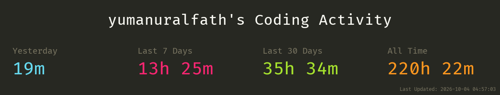
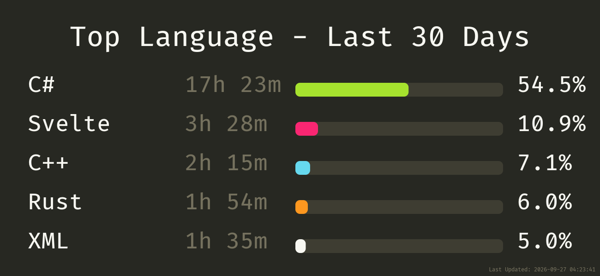
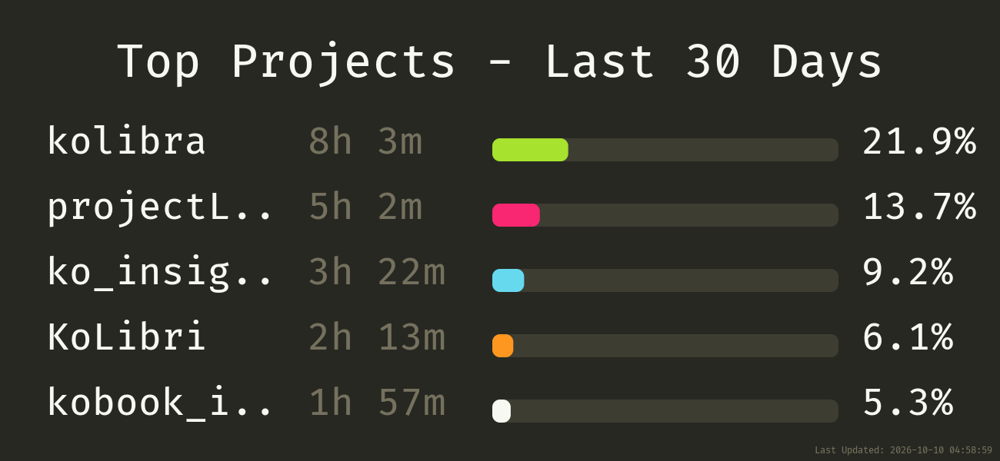
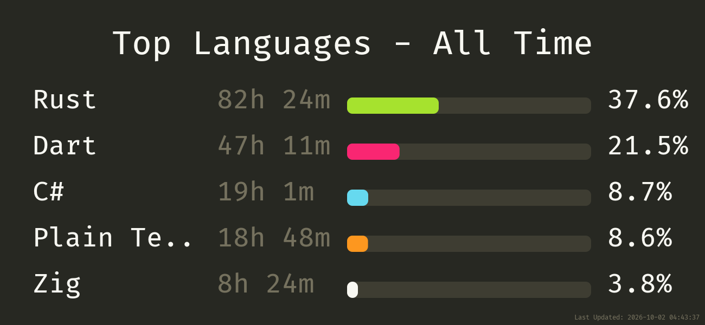
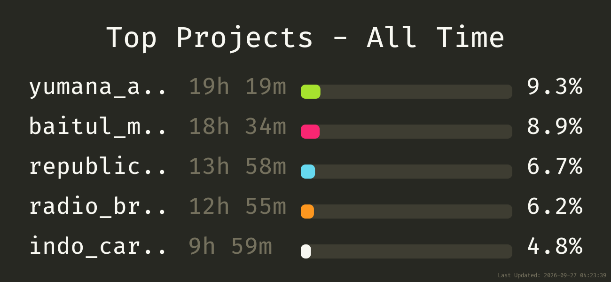
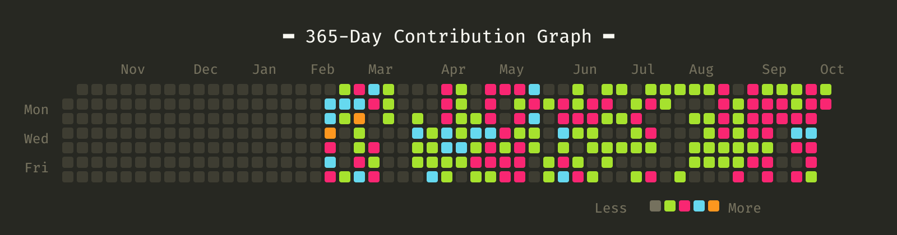
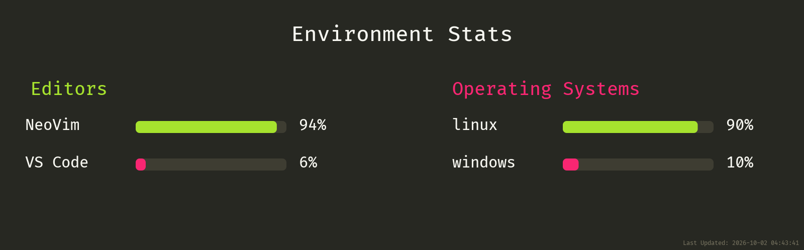

<div align='center'>
<summary><h1 style="color: red;">Welcome to My Profile✨</h1></summary>
</div>
<div align="center">
<!--horizontal divider(gradiant)-->

</div>
  
</div>
<!--h1 without bottom border-->

<!--takatime-start-->

<h2 align="center">TakaTime Weekly Report</h2>

<p align="center">
  <br/>
  
  <br/>
  
  <br/>
  
  
</p>

<p align="center"><em>Generated automatically by <a href="https://github.com/Rtarun3606k/TakaTime">TakaTime</a></em></p>

<!--takatime-end-->
<p align="center">
  
</p>

**Code Time Since May 4, 2024**

- [](https://wakatime.com/@dc384f06-ca40-47b3-af9c-3e0560a1bcfa)
- [](https://leetcode.com/yumanuralfath)
  <!--START_SECTION:waka-->


**I'm an Early 🐤** 

```text
🌞 Morning                992 commits         █████████████░░░░░░░░░░░░   53.10 % 
🌆 Daytime                446 commits         ██████░░░░░░░░░░░░░░░░░░░   23.88 % 
🌃 Evening                384 commits         █████░░░░░░░░░░░░░░░░░░░░   20.56 % 
🌙 Night                  46 commits          █░░░░░░░░░░░░░░░░░░░░░░░░   02.46 % 
```
📅 **I'm Most Productive on Saturday** 

```text
Monday                   281 commits         ████░░░░░░░░░░░░░░░░░░░░░   15.04 % 
Tuesday                  277 commits         ████░░░░░░░░░░░░░░░░░░░░░   14.83 % 
Wednesday                315 commits         ████░░░░░░░░░░░░░░░░░░░░░   16.86 % 
Thursday                 183 commits         ██░░░░░░░░░░░░░░░░░░░░░░░   09.80 % 
Friday                   248 commits         ███░░░░░░░░░░░░░░░░░░░░░░   13.28 % 
Saturday                 323 commits         ████░░░░░░░░░░░░░░░░░░░░░   17.29 % 
Sunday                   241 commits         ███░░░░░░░░░░░░░░░░░░░░░░   12.90 % 
```


📊 **This Week I Spent My Time On** 

```text
💬 Programming Languages: 
Rust                     10 hrs 17 mins      ████████████░░░░░░░░░░░░░   48.53 % 
Svelte                   5 hrs 20 mins       ██████░░░░░░░░░░░░░░░░░░░   25.17 % 
TypeScript               1 hr 19 mins        ██░░░░░░░░░░░░░░░░░░░░░░░   06.27 % 
Bash                     57 mins             █░░░░░░░░░░░░░░░░░░░░░░░░   04.51 % 
TOML                     51 mins             █░░░░░░░░░░░░░░░░░░░░░░░░   04.04 % 

🐱‍💻 Projects: 
kolibra                  8 hrs 19 mins       ██████████░░░░░░░░░░░░░░░   39.29 % 
ko_insight               5 hrs 32 mins       ███████░░░░░░░░░░░░░░░░░░   26.14 % 
Unknown Project          2 hrs 56 mins       ███░░░░░░░░░░░░░░░░░░░░░░   13.86 % 
KoLibri                  1 hr 38 mins        ██░░░░░░░░░░░░░░░░░░░░░░░   07.71 % 
yumana_api_V2            1 hr 9 mins         █░░░░░░░░░░░░░░░░░░░░░░░░   05.50 % 
```

🤖 **AI Coding This Week** 

```text
⏱ AI Coding Time: 5 hrs 14 mins (24.74%)

✍️ 2,938 lines written by AI, 3,373 lines written by hand (46.55% AI-written)

🔤 537,028 Input Tokens, 6,497 Output Tokens

💵 $1.71 Estimated AI Cost This Week

🧠 18 AI Sessions, 96 AI Prompts

Github-Copilot           3,026 lines         █████████████████████████   100.00 % 

🔎 AI Coding Insights:
⚖️ Balanced with AI — 46.55% of written lines came from AI
📚 Verbose Prompter — average 3,448 characters per prompt
🔁 Iterative Prompter — average 5 prompts per session
🔍 Hands-On Reviewer — 65.22% of changed lines were hand-edited
```

**I Mostly Code in Rust** 

```text
Rust                     24 repos            █████░░░░░░░░░░░░░░░░░░░░   21.62 % 
C#                       4 repos             █░░░░░░░░░░░░░░░░░░░░░░░░   03.60 % 
CSS                      3 repos             █░░░░░░░░░░░░░░░░░░░░░░░░   02.70 % 
Svelte                   3 repos             █░░░░░░░░░░░░░░░░░░░░░░░░   02.70 % 
GDScript                 1 repo              ░░░░░░░░░░░░░░░░░░░░░░░░░   00.90 % 
```


 Last Updated on 06/10/2026 21:29:54 UTC
<!--END_SECTION:waka-->

<!--h1 without bottom border-->
<!-- <div id="user-content-toc"> -->
<!--   <ul align="center"> -->
<!--     <summary><h2 style="display: inline-block">Technologies That I Know👨🏻‍💻</h2></summary> -->
<!--   </ul> -->
<!-- </div> -->
<!--tech stack icons-->
<!-- <p align="center"> -->
<!--   <a href="https://skillicons.dev"> -->
<!--      -->
<!--   </a> -->
<!-- </p> -->

<!-- Connect with me -->
<!--h2 without bottom border-->
<div id="user-content-toc">
  <ul align="center">
    <summary><h2 style="display: inline-block">Connect With Me🤝</h2></summary>
  </ul>
</div>

<!--icons and links-->
<p align="center">
<a href="https://www.linkedin.com/in/yumana/" target="blank"></a>
<a href="https://www.instagram.com/yumana20" target="blank"></a>
<a href="https://discordapp.com/users/393721612358254592" target="blank"></a>
  
</p>

<!--horizontal divider(gradiant)-->


---
